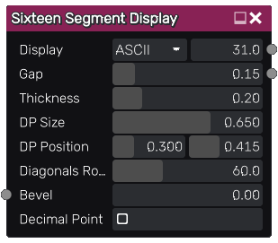
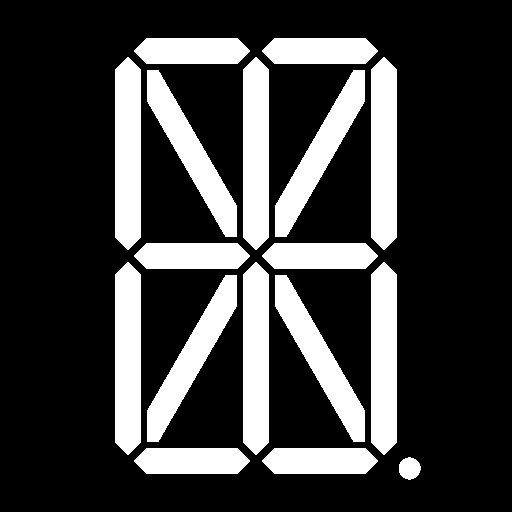

Sixteen segment display node
~~~~~~~~~~~~~~~~~~~~~~~~~~~~

The **Sixteen Segment Display** node outputs a sixteen segment display with variable weight

Inputs
++++++

The **Sixteen Segment Display** node accepts an optional bevel map, which the parameter is multiplied by the map value.

Outputs
+++++++

The **Sixteen Segment Display** node outputs two greyscale images, the generated display and a hard mask for all segments

Parameters
++++++++++

The **Sixteen Segment Display** node accepts the following parameters:

* The *ASCII* parameter specifies the character on the display.

* The *Gap* parameter specifies the distance between each segment on the display.

* The *Thickness* parameter controls the thickness of the segments.

* The *DP Size* parameter controls the size of the decimal point on the display.

* The *DP Position* parameter specifies the position of the decimal point on the display.

* The *Diagonals Rotation* parameter controls the rotation of the four diagonal segments on the display.

* the *Bevel* parameter controls the width of the edge of each segment.

Example images
++++++++++++++

