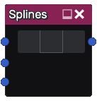

Splines node
~~~~~~~~~~~~

The **Splines** node outputs a simple RGBA image containing any number of splines defined by control points

Inputs
++++++

The **Splines** node accepst an optional image to map onto the splines with the **Edge** parameter, and 
an optional image to fill the inside area of a spline with the **Fill** input.

Additionally, the **Guide** input can be used to add a transparent image in the splines editor to guide point placement.

Outputs
+++++++

The Splines node generates an RGBA image containing any number of splines, with the optional inputs mapped onto them

Parameters
++++++++++

The **Splines** node has the following parameters:

* the control points that define the splines
* the **width** of the curve to be drawn, which is set per control point
* the **offset** defines how the edge image is offset at each control point

Notes
+++++

When selecting points, Ctrl-clicking can be used to select multiple control points, and 
Shift-clicking control points will select every point along the path.

Enabling the *Progressive* option will interpolate between all selected control points 
any changes done to **width** and **offset**

Example images
++++++++++++++

