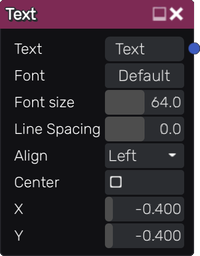

Text node
~~~~~~~~~

The text node outputs a single texture that shows a text.

Inputs
++++++

The text node does not accept any input.

Outputs
+++++++

The text node provides a single texture.

Parameters
++++++++++

The text node accepts the following parameters:

* String to be displayed

* Font (both TTF and OTF formats are supported)

* Font size

* X and Y coordinates of the location of the text in the generated image

* Text color

* Background color

* Whether the text is centered

Notes
+++++

The text node can render any unicode character, including emojis.
