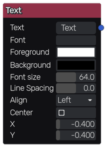

Text node
~~~~~~~~~

The text node outputs a single texture that shows a text. New lines
can be added by using the '\n' character (without single quotes).

Right clicking on the text box will also bring up a text editor.

Inputs
++++++

The text node does not accept any input.

Outputs
+++++++

The text node provides a single texture.

Parameters
++++++++++

The text node accepts the following parameters:

* the string to be displayed

* the font (both TTF and OTF formats are supported)

* the font size

* the (extra, can be negative) line spacing, if there are multiple lines

* horizontal alignment(left, right or center) of the text

* whether the text is centered

* the X and Y coordinates of the location of the text in the generated image

Notes
+++++

The text node can render any unicode character, including emojis.