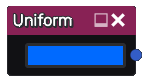

Uniform nodes
~~~~~~~~~~~~~

The **Uniform** and **Uniform/Grayscale** node output a single uniform image
whose color is configurable.

Inputs
++++++

The uniform nodes do not accept any input.

Outputs
+++++++

The uniform nodes provide an output that generates a uniform color image.

Parameters
++++++++++

The **Uniform** node has a single *color* parameter that defines the color of
the output image. The **Uniform/Grayscale** node has a single *float* parameter.

Notes
+++++

Pasting a text containing a single HTML color (in the #1234ab syntax) into a 
graph editor will create a Uniform node with the specified color. Pasting a list 
of colors will create a Colorize node instead.