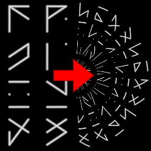

Circle Map node
~~~~~~~~~~~~~~~

The **Circle Map** node is variadic and map input images in a circle into the outputs.

.. image:: images/node_transform_circlemap.png
	:align: center

Inputs
++++++

The **Circle Map** node accepts one or more RGBA inputs.

Outputs
+++++++

The **Circle Map** node outputs the deformed images.

Parameters
++++++++++

The **Circle Map** node has two parameters:

* *radius* is the radius of the circle in which the input image will be remapped

* *repeat* is the number of repetitions of the input image around the circle

Example images
++++++++++++++

