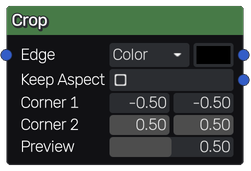

Crop node
~~~~~~~~~

The **Crop** node crop input images.

Inputs
++++++

The **Crop** node accepts a RGBA input.

Outputs
+++++++

The **Crop** node outputs a preview that is useful when adjusting the crop area,
and a second output which shows the resulting crop.

Parameters
++++++++++

The **Crop** node has the following parameters:

* *Edge Mode* which specifies the behavior of contents shown beyond the
  crop area, that can be the following: *Alpha*, *Repeat*, *Continous* and *Color*.

* *Edge Color* specifies the color to use for contents beyond the crop area. This
  option is only effective if *Edge* is set to *Color*

* *Keep Aspect* specifies whether the cropped content will be centered and scaled
  to the unit square with aspect ratio (based on the crop size) kept. Otherwise
  the cropped content is stretched to fill the unit square.
  
* *Corner 1* specifies the position of the first crop handle alogn the X and Y axis.

* *Corner 2* specifies the position of the second crop handle alogn the X and Y axis.

* *Preview Alpha* adjusts the opacity of the background beyodn the crop area. This is
  only visible in the preview output for ease of adjusting the crop.
