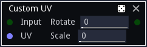

Custom UV node
~~~~~~~~~~~~~~

The **Custom UV** node deforms an input image according to a custom UV map given as input.

Inputs
++++++

The **Custom UV** node accepts two inputs:

* The *Source* inputs is the image to be deformed.

* The *UV* input is a color image whose red and green channels are used as
  U and V (X and Y in texture space) coordinates, and the blue channel holds
  a value to be used for pseudo-random scale and rotate transforms.

Outputs
+++++++

The **Custom UV** node outputs the deformed image.

Parameters
++++++++++

The **Custom UV** node accepts the following parameters:

* *Inputs* is the number of alternate shapes in the input (1, 4 or 16). Images containing several
  shapes can easily be created using the **Tile2x2** node.
* *Scale X and Scale Y* are the scale along X and Y axes applied to each instance.
* *Rnd Rotate* is the maximum angle of the random rotation applied to each instance.
* *Rnd Scale* is the amount of random scaling applied to each instance.
* *Variations*: if checked, the node will deform different variations of its input
  (i.e. roll a different seed for each instance)
