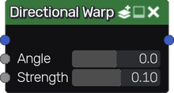

Directional Warp node
~~~~~~~~~~~~~~~~~~~~~

The **Directional Warp** node is variadic and deforms one or more
input images towards a specified angle.

Inputs
++++++

The **Directional Warp** node accepts one or more color images as input.

* The *AngleMap* specifies an optional angle (in degrees) map for the
  warp operation which is multiplied by the angle value.

* The *StrengthMap* defines an optional strength map of the warp
  operation, which multiples 1 or -1 that depends linearly on the
  input image. See :doc:`Transform Node </node_transform>` inputs for details.

Outputs
+++++++

The **Directional Warp** node outputs the deformed image.

Parameters
++++++++++

The **Directional Warp** node has two parameters:

* *Angle* of the deformation.

* *Strength* of the deformation.

Example images
++++++++++++++

