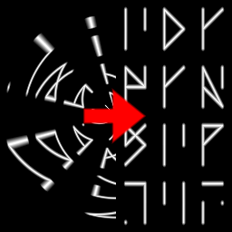

Inverse Circle Map node
~~~~~~~~~~~~~~~~~~~~~~~

The **Inverse Circle Map** node is variadic and unwraps input images from a circle into the outputs.

Inputs
++++++

The **Inverse Circle Map** node accepts one or more RGBA inputs.

Outputs
+++++++

The **Inverse Circle Map** node outputs the unwrapped images.

Parameters
++++++++++

The **Inverse Circle Map** node does not have any parameter.

Example images
++++++++++++++

