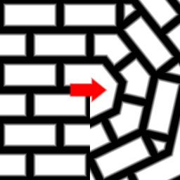

Kaleidoscope node
~~~~~~~~~~~~~~~~~

The **Kaleidoscope** node is variadic and applies a kaleidoscope effect, i.e. copies
an angle (by default the upper one) all around the image to its inputs.

.. image:: images/node_transform_kaleidoscope.png
	:align: center

Inputs
++++++

The **Kaleidoscope** node accepts one or more RGBA inputs.

Outputs
+++++++

The **Kaleidoscope** node outputs the results as RGBA.

Parameters
++++++++++

The **Kaleidoscope** node has three parameters:

* *count* to set the number of replications of the input.

* *offset* is the offset angle used to select the area in the input that is replicated.

* *variations* can be checked to select a different variation for each replication.

Example images
++++++++++++++

