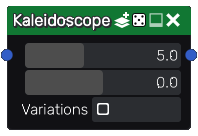

Kaleidoscope node
~~~~~~~~~~~~~~~~~

The **Kaleidoscope** node applies a kaleidoscope effect, i.e. copies an angle (by default the
upper one) all around the image to its input.

Inputs
++++++

The **Kaleidoscope** node accepts a single RGBA input.

Outputs
+++++++

The **Kaleidoscope** node outputs the result as RGBA.

Parameters
++++++++++

The **Kaleidoscope** node has two parameters:

* *strength* to scale the warp effect.

* *epsilon* is used to evaluate the second input's derivative

Example images
++++++++++++++

.. image:: images/node_kaleidoscope_samples.png
	:align: center
