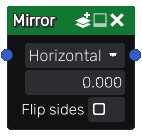

Mirror node
~~~~~~~~~~~

The **Mirror** node applies a mirror filter on its input.

Inputs
++++++

The **Mirror** node accepts a single RGBA input.

Outputs
+++++++

The **Mirror** node outputs the mirrored image as RGBA.

Parameters
++++++++++

The **Mirror** node has two parameters:

* the *direction* of the effect (horizontal or vertical).

* the *offset* by which the input is moved away from the mirror.

Example images
++++++++++++++

