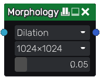

Morphology node
~~~~~~~~~~~~~~~

The **Morphology** node applies a morphology dilation or erosion on its input.

Morphology dilation dilates lightest areas, and morphology erosion dilates darkest areas.

Inputs
++++++

The **Morphology** node accepts a single RGB input.

Outputs
+++++++

The **Morphology** node outputs the transformed image as RGBA.

Parameters
++++++++++

The **Morphology** node has 3 parameters:

* the *operation* (Dilation or Erosion).

* the *resolution* of the result.

* the *distance* by which (light or dark) areas are dilated.

Example images
++++++++++++++

