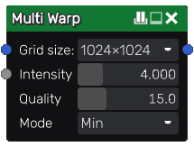

Multi Warp node
.................

The **Multi Warp** node deforms an input image according to the derivative of the second input image.
Unlike **Warp** node, the derivative of the second texture is sampled at each iteration 
producing more varied results at cost of the performance.

Inputs
++++++

The **Multi Warp** node accepts two inputs:

* The *Source* inputs is the image to be deformed.

* The *Displace* input is a greyscale image whose derivative will be used to deform the source.

Outputs
+++++++

The **Multi Warp** node outputs the deformed image.

Parameters
::::::::::

The **Multi Warp** node has the following parameters:

* the *Grid size* determines the resolution of the operation

* the *intensity* of the warp effect

* the *quality* of the Multi warp calculation

* the blend *mode*, that can be one of the following: Min, Blur, Max

Example images
::::::::::::::

	Edge damage using "Min" blend mode.

	"Blur" blend mode.