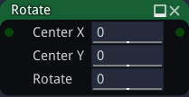

Rotate node
~~~~~~~~~~~

The **Rotate** node applies a rotation to one or more input images.

Inputs
++++++

The **Rotate** node accepts color images as input.

Outputs
+++++++

The **Rotate** node outputs the transformed images.

Parameters
++++++++++

The **Rotate** node *Center X* and *Center Y* parameters that define the center
of the rotation and a *Rotate* parameter that defines the angle.
