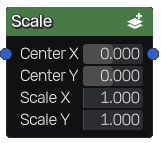

Scale node
~~~~~~~~~~~

The **Scale** node applies a scale transform to one or more input images.

Inputs
++++++

The **Scale** node accepts color images as input.

Outputs
+++++++

The **Scale** node outputs the transformed images.

Parameters
++++++++++

The **Scale** node *Center X* and *Center Y* parameters that define the center
of the scale operation and *Scale X* and *Scale Y* parameter that defines the scale
ratios along both axes.
