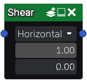

Shear node
~~~~~~~~~~

The **Shear** node is variadic and bend inputs along te X or Y axis.

Inputs
++++++

The **Shear** node accepts one or more RGBA inputs.

Outputs
+++++++

The **Shear** node outputs the shear stressed images as RGBA.

Parameters
++++++++++

The **Shear** node has two parameters:

* the *direction* of the effect (horizontal or vertical).

* the *offset* by which the input is bent.

Example images
++++++++++++++

