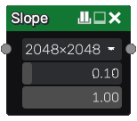

Slope node
~~~~~~~~~~

The **Slope** node creates slopes from highest areas of its input.

It is similar to Dilate, but will expand from any part of the image, not only
white areas.

Inputs
++++++

The **Slope** node accepts a single greyscale input, interpreted as a heightmap.

Outputs
+++++++

The **Slope** node outputs the transformed heightmap as greyscale.

Parameters
++++++++++

The **Slope** node has 3 parameters:

* the *size* of the image.

* the *length* of the slope effect.

* the *slope* of the effect (1 is 45°, higher values are steeper).

Example images
++++++++++++++

