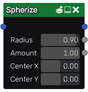
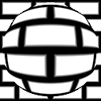

Spherize node
~~~~~~~~~~~

The **Spherize** node is variadic and distort images as if they were wrapped around a sphere.

Inputs
++++++

The **Spherize** node accepts one or more color images as input.

Outputs
+++++++

The **Spherize** node outputs the distorted input images, a hard mask of the spherized portion of the images, and a radial falloff from the sphere.

Parameters
++++++++++

The **Spherize** node has the following parameters:

* *Radius* define the scale of the sphere.

* *Amount* defines the strength of the distortion

* *Scale* defines the scale of the input image on the sphere

* *Offset X* and *Offset Y* define the location of the sphere along the X and Y axes.

Example images
++++++++++++++

