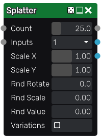
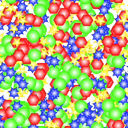

Splatter node
~~~~~~~~~~~~~

The **Splatter** node splats several instances of its input with optional scale and rotation variations.
instances are mixed with each other using a *lighten* filter.

The **Splatter** also has a color version whose input is in RGBA format.

Inputs
++++++

The **Splatter** node accepts two inputs:

* The *Source* inputs is the image to be splat into the output.

* The *Mask* input is a greyscale image that is used as a mask and affects each instance's value.

Outputs
+++++++

The **Splatter** node outputs the splat image.

Parameters
++++++++++

The **Splatter** node has two parameters:

* *Count*, the number of instances of the source image in the result, including those canceled by the mask.
* *Inputs* is the number of alternate shapes in the input (1, 4 or 16). Images containing several
  shapes can easily be created using the **Tile2x2** node.
* *Rotate* is the maximum angle of the random rotation applied to each instance.
* *Scale* is the amount of scaling applied to each instance.

Example images
++++++++++++++

