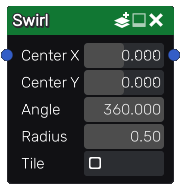

Swirl node
~~~~~~~~~~

The **Swirl** node is variadic and applies a swirl effect on its inputs.

Inputs
++++++

The **Swirl** node accepts one or more RGBA inputs, interpreted as a heightmap.

Outputs
+++++++

The **Swirl** node outputs the transformed images as RGBA.

Parameters
++++++++++

The **Swirl** node has 3 parameters:

* the coordinates of the center of the effect.

* the *Angle* of the swirl effect.

* the *Radius* of the swirl effect.

* an option to make the effect tileable.

Example images
++++++++++++++

