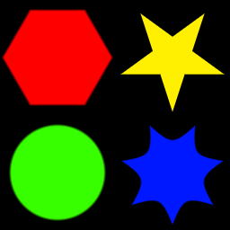

Tile 2x2 node
~~~~~~~~~~~~

The **Tile 2x2** node combines 4 input images into a single output by tiling them.

.. image:: images/node_transform_tile2x2.png
	:align: center

Inputs
++++++

The **Tile 2x2** node accepts 4 RGBA inputs.

Outputs
+++++++

The **Tile 2x2** node outputs the tiled RGBA image.

Parameters
++++++++++

The **Tile 2x2** does not have any parameter.

Example images
++++++++++++++

