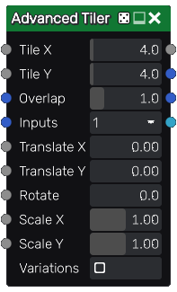

Advanced Tiler node
~~~~~~~~~~~~~~~~~~~

The **Advanced Tiler** node tiles several instances of its input with optional scale and rotation variations.
Overlapping instances are mixed with each other using a *lighten* filter.

The **Advanced Tiler** also has a color version whose input is in RGBA format.

While the **Tiler** nodes has parameters to randomize the result, the **Advanced Tiler**
only randomizes selected images from atlases, and generated color maps if color map
inputs are not connected

Inputs
++++++

The **Advanced Tiler** node accepts nine inputs:

* The *Source* inputs is the image to be splatted into the output.
* The *Mask* input is a greyscale image that is used as a mask and affects each instance's value.
* The *Color map* inputs 1 and 2 are RGBA maps used as inputs to generate instance map outputs.
* The *Translate X* and *Translate Y* input maps are used to offset each instance.
* The *Rotate* input map is used to rotate each instance.
* The *Scale X* and *Scale Y* input maps are used to scale each instance.
* *Variations*: if checked, the node will tile different variations of its input
  (i.e. roll a different seed for each instance)

The **Remap** node can be used to generate input maps (*Translate X*, *Translate Y*, *Rotate*,
*Scale X* and *Scale Y*) easily. It takes a greyscale image as input and defines the
target interval and a step for the output values. For example; using random noise through a
**Remap** node to drive a *Rotate* input set to 180, you could set it's *Min* value to -1,
it's *Max* value to 1 and it's *Step* value to 0.5 and you would get randomly rotated instances
snapped to 90 degree intervals.

The **HeightToAngle** node can be used to easily generate a *Rotate* map from a
heightmap. All instances will be rotated depending on the slope. When using this
node to generate the *Rotate* map, the *Rotate* parameter must be set to 180.

The **HeightToOffset** node can be used to easily generate a *Translate* map from a
heightmap. Outputs must be connected to the Translate X and Y inputs of the Tiler node.
All instances will be translated depending on the slope, to reach the
specified level, and to be accurate, the slopes must be homogeneous. When using this
node to generate the *Translate* map, the *Translate X* and *Translate Y* parameters
must be set to 1.

Outputs
+++++++

The **Advanced Tiler** node outputs the splat image and 2 instance color maps.

Parameters
++++++++++

The **Advanced Tiler** node accepts the following parameters:

* *Tile X* and *Tile Y*, the number of columns and rows of of the tile pattern.
* *Overlap* is the number of overlapping instances for each instance.
* *Inputs* is the number of alternate shapes in the input (1, 4 or 16). Images containing several
  shapes can easily be created using the **Tile2x2** node.
* The *Translate X* and *Translate Y* parameters are used to offset each instance.
* The *Rotate* parameter is used to rotate each instance.
* The *Scale X* and *Scale Y* parameters are used to scale each instance.

The *Translate X*, *Translate Y*, *Rotate*, *Scale X* and *Scale Y* are multiplied
with their corresponding input map.

Example images
++++++++++++++

.. image:: images/node_transform_tiler_samples.png
	:align: center
