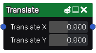

Translate node
~~~~~~~~~~~~~~

The **Translate** node applies a translation to one or more input images.

Inputs
++++++

The **Translate** node accepts color images as input.

Outputs
+++++++

The **Translate** node outputs the transformed images.

Parameters
++++++++++

The **Translate** node *Translate X* and *Translate Y* parameters that define the translation.
