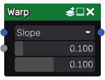

Warp node
~~~~~~~~~

The **Warp** node is variadic and deform one or more input images according to the
derivative of a grayscale image.

Inputs
++++++

The **Warp** node accepts three inputs:

* The *Source* input is the image to be deformed.

* The *Height map* input is a grayscale image whose derivative will be used to deform the source.

* Optional *Strength map* which multiplies the *strength* parameter by the map value.

Outputs
+++++++

The **Warp** node outputs the deformed image.

Parameters
++++++++++

The **Warp** node has three parameters:

* *mode*, that defines how the warp node calculates the offset it applies. *Slope* offsets by
  a distance calculated from the slope, and *Distance to top* offsets by a distance calculated
  from the slope and the distance to the top (this mode makes it posible to make all points
  of a slope get their value from the top, hence generating mosaic-like patterns).

* *strength* to scale the warp effect.

* *epsilon* is used to evaluate the second input's derivative.

Example images
++++++++++++++

.. image:: images/node_warp_samples.png
	:align: center
