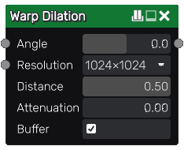

Warp Dilation node
~~~~~~~~~~~~~~~~~~

The **Warp Dilation** node dilates its input image along the slope or contours of a
heightmap. For each pixel, it samples the input image along that path and keeps the
highest value (after the attenuation factor is applied).

Inputs
++++++

The **Warp Dilation** node accepts two inputs:

* The *Input* input is the image to be deformed.

* The *Heightmap* input is a grayscale image whose slopes or contours will be used to deform the source.

Outputs
+++++++

The **Warp Dilation** node outputs the deformed image.

Parameters
++++++++++

The **Warp Dilation** node has three parameters:

* *Angle*, that defines the angle from the slopes along which the warp effect is performed

* *Resolution*, that defined the precision of the effect

* *Distance*, that defines the distance along which the effect is performed

* *Attenuation*, that defines the value attenuation that is applied along the path

Example images
++++++++++++++

.. image:: images/node_warpdilation_sample.png
	:align: center
