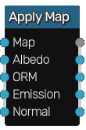

Apply Map node
~~~~~~~~~~~~~~

The **Apply Map** node applies a map to a simple material by adjusting its orientation and offset,
and outputs the modified map and the height information.

Inputs
++++++

The **Apply Map** node accepts a map (generated by the **CreateMap** node) and
the 4 (albedo, ORM, emission and normal) components of a simple material as inputs.

Outputs
+++++++

The **Apply Map** node outputs the height, albedo, ORM, emission and normal components
of the map.

Parameters
++++++++++

The **Apply Map** node does not have any parameter.
