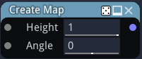

CreateMap node
~~~~~~~~~~~~~~

The **CreateMap** node creates a map holding height, orientation and offset information
used to combine simple materials.

Inputs
++++++

The **CreateMap** node accepts two inputs:

* the *height* component as a greyscale image.

* an optional offset map.

Outputs
+++++++

The **CreateMap** node outputs the map in an RGB image where:

* the red component holds the height information

* the green component holds the orientation information

* the blue component holds the offset information

Parameters
++++++++++

The **CreateMap** node has two parameters:

* *height* is the maximum height of the map

* *angle* is the orientation of the map
