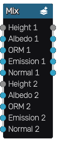

Mix node
~~~~~~~~

The **Mix** node mixes two applied maps based on the height information.

Inputs
++++++

The **Mix** node accepts the height, albedo, ORM, emission and normal channels of both
applied maps as inputs.

Outputs
+++++++

The **Mix** node outputs the height, albedo, ORM, emission and normal components
of the combined map.

Parameters
++++++++++

The **Mix** node does not have any parameter.
