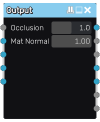

Output node
~~~~~~~~~~~

The **Output** node converts an applied map into a material. It uses the height to
generate the normal and occlusion maps.

Inputs
++++++

The **Output** node accepts accepts the height, albedo, ORM, emission and normal channels
of the applied map inputs.

Outputs
+++++++

The **Output** node outputs the albedo, metallic, roughness, emission, normal, occlusion
and depth components of the material. They should be connected to the **Material** node.

Parameters
++++++++++

The **Output** node accepts the following parameters:

* the amount of occlusion extracted from the height map

* the strength of the normal maps of the base material (when mixed with the
  normal map generated from the height map)

