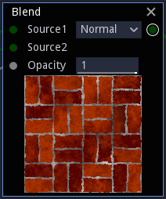

Common properties of nodes
--------------------------

The nodes will always have outputs that will be connected to the inputs of other
nodes. They may also (and will probably) have parameters that can be modified
in the user interface, and inputs to receive data from other nodes.

Outputs
^^^^^^^

Nodes can have several outputs that represent the images they provide. Each node output can be
connected to several node inputs. Each node output (and input) can be:

* a **greyscale image** (shown in grey) 

* a **color image** (shown in blue)

* an **RGBA image** (shown in semi-transparent green)

* a **2D signed distance function** (shown in orange)

* a **3D signed distance function** (shown in red), with or without a color index

* a **3D texture** (shown in fuchia), that can be associated to a color index, which makes
  it possible to associate several 3D textures in a single 3D scene

Greyscale, color and RGBA inputs and outputs can be connected to each other and will automatically be
converted when required.

2D signed distance functions have a specific preview that shows the associated signed distance
field. They can be converted into greyscale images using the `sdShow` node.

3D signed distance functions have a specific preview that shows the lit 3D scene. They can be
converted into a greyscale height map and a color normal map using the `Render` node.

Clicking on an output slot will show the corresponding preview at the bottom of the node.
When a node has several outputs, only one of them can be previewed at a time. The previewed
output slot will have a circle around it, and clicking it again will hide the preview.

Inputs
^^^^^^

Inputs are images the node will transform (if any). An input is always connected to at most
one output. Inputs generally have a default value that is used when it is not connected.

Parameters
^^^^^^^^^^

Parameters are used to configure nodes. The following types are supported:

* **float** parameters are used whenever a real number is needed. Float parameters have
  bounds, but it is possible to ignore them (at your own risk). To modify a float parameter,
  click in the text field and enter a new value, or click and drag left or right to decrease
  or decrease its value. When the lower or upper bound is reached, the value will stick to it,
  but dragging again from there makes it possible to go beyond the limit.

  In most cases, float parameters also support expressions (written in GLSL syntax),
  where other parameters and named parameters are accepted and must be prefixed with
  a dollar sign. This feature is useful when two parameters of the same node must
  depend on each other, or when several parameters of several nodes of a subgraph
  must be calculated from one or more named parameters.
  
  The *$time* variable can also be used in parameter expressions to define animations
  in generated shaders, but generated **Static PBR Materials** will still be
  static (this feature could for example be used to export variations of the
  same material). Other predefined material types can fully benefit from this
  feature.

  Randomness can be added to any node by using the *$rnd(min, max)* function,
  that will generate a random number between *min* and *max*. The node's seed
  can then be modified, copied or locked using the die button.
* **size** parameters are power of two values for the image size. They are used when
  actually storing data in a texture, or when performing resolution dependent calculations
  such as convolutions. They are shown as drop down list boxes.
* **enumerated** parameters are used when nodes have different named options and shown as
  drop down list boxes.
* **boolean** parameters are shown as check boxes.
* **color** parameters are shown as Color selectors.
* **gradient** parameters are edited in dedicated editor widgets. Cursors can be added by
  double-clicking in the lower part of the widget, dragged left and right using the left
  mouse button, and removed using the right mouse button.

  .. image:: images/gradient_editor.png
    :align: center

  The drop down list box can be used to select one of the 4 interpolation options.
  
  Double clicking in the upper part of the gradient editor will open a larger version of the
  widget to move cursors mode precisely.

  Finally, it is possible to drag and drop from the upper part of a gradient editor widget to
  another to duplicate the gradient parameter, or from any **Colorize** node variant in the
  library to a gradient editor widget.

* **curve** parameters are edited using a dedicated dialog window that is shown when clicking on
  the parameter.
  
  .. image:: images/curve_editor.png
    :align: center
    :scale: 50%

  The curve is defined by its control points that define their value and left and right slopes
  for given abscissas. Control points (as well as slope control points) can be grabbed and moved
  using the left mouse button.

  New control points can be added by double-clicking in the editor, and control points can be
  removed using the right mouse button.

  The curve editor comes with a selection of presets available in the **Presets** menu and an
  **Invert** button to invert the curve. Presets included are: Linear, EaseOut, EaseInOut,
  EaseOut, SawTooth, Bounce and Bevel.

* **polygon** parameters are edited using a dedicated dialog window that is shown when clicking on
  the parameter.
  
  .. image:: images/polygon_editor.png
    :align: center
    :scale: 50%

  The polygon parameter is defined by its vertices that can be grabbed and moved using the left
  mouse button.
  
  New vertices can be created by double-clicking in the editor (when created, a new vertex will
  be used to split the closest edge), and deleted using the right mouse button.

Randomness
^^^^^^^^^^

Nodes that provide random patterns have an implicit **seed** parameter. It is not possible
to edit it directly, but clicking the small die button in the node's title bar will change
its value.
Right clicking this button will show a context menu that can be used to copy and paste the
seed as well as lock and unlock it. A node with locked seed will not be affected by its
parents and will have the same seed in all variations.

Subgraphs also have their seed and transmit it to their children unless not configured to
do so, or the children's seeds are frozen.

Modifying nodes
^^^^^^^^^^^^^^^

Most nodes in Material Maker can be modified, but they first have to be made editable.
To do this, select a node, and use the **Tools -> Make the selected nodes editable**
menu item or the **Control+W** keyboard shortcut.

When made editable, 3 buttons are shown at the bottom of the node:

* A pencil-shaped button to edit the node (the precise behavior of this button depends
  on the node type)
* A folder-like button to load an existing node template
* A floppy disk button to save the node as a template

Loading and saving templates are only useful when contributing new nodes
for Material Maker. Modifying your Material Maker installation may break
compatibility with existing materials, and is not recommended unless you
know what you are doing.

To be reusable directly, templates must be saved in the **generators** directory in
the install dir (or the **addon/material_maker/nodes** directory when using Material
Maker as a Godot addon). All nodes templates saved in this directory are shown in
the **Tools -> Create** menu.

It is not recommended to save newly created nodes as templates, but this
makes them a lot easier to access and results in smaller material files (only
references to the templates are saved and not the whole node description).
Consequently, modifying a template without ensuring compatibility with the old
version (i.e. removing or renaming parameters, removing or swapping inputs or
outputs) may break existing materials, and should thus be avoided.
