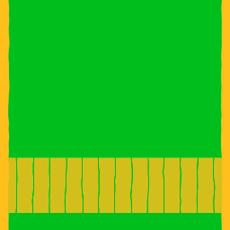
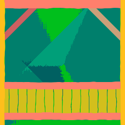
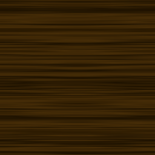
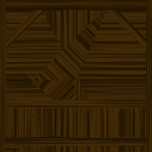
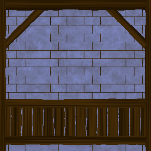
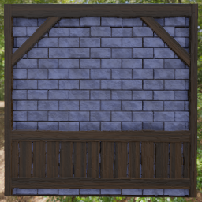

Workflow nodes
--------------

The workflow nodes can be used to organize the generation of complex materials, based
on simple homogeneous materials and maps that describe the overall geometry of the
whole material.

The **CreateMap** node is used to create a map that holds the height, orientation and
offset of the material.

The **MixMaps** node can be used to combine maps (based on their
height information) that will be applied to the same material.

Base (flat) materials consist of albedo, ORM (ambient occlusion, roughness, metallic),
emission and normal channels. A few example materials are provided in the
**Workflow/Materials** section of the library.

Maps are then applied to base materials using the **ApplyMap** node to generate
new (reoriented and offset) materials (with albedo, ORM, emission and normal) associated
to height information.

Different materials with height information can then be mixed based on their height
using the **Mix** node to generate more complex materials.

The result can then be fed into the **Material** node using the **Output** node, that
generates the overall normal and ambient occlusion maps using the height map.

.. toctree::
	:maxdepth: 1

	node_workflow_create_map
	node_workflow_mix_maps
	node_workflow_apply_map
	node_workflow_mix
	node_workflow_output
