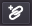
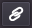
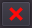
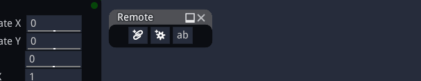
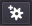
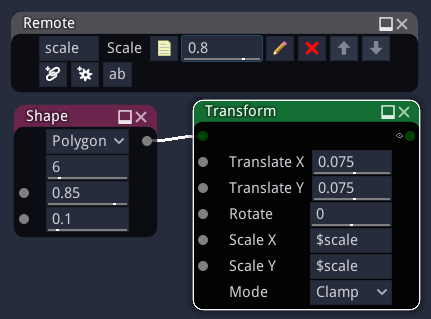

Remote nodes
------------

Remote nodes have no input or output. They are only used to control (remotely) the
parameters of other nodes. They can be used to either gather important parameters
of a complex graph or define the parameters of a subgraph node.

Creating a remote node
^^^^^^^^^^^^^^^^^^^^^^

Remote nodes can be created by dragging a Miscellaneous/Remote node from the library
panel to a graph panel.

Configuring a remote node
^^^^^^^^^^^^^^^^^^^^^^^^^

Remote nodes provide three kinds of controls:

* linked widgets, that are associated to parameters in the graph and whose values are copied
  into the target parameters
* configuration widgets, that can be used to define named configurations of the target
  parameters
* named parameters, that can be used in expressions in all nodes of the subgraph

Linked widgets
~~~~~~~~~~~~~~

Linked widgets can be used to modify at the same time several parameters from several nodes.

When hovering a linked widget, the user interface will show which parameters it controls.

To create a linked widget, click on the |create_linked_widget| button and select a parameter
to be controlled in another node. This will create a new linked widget whose type is the
same as the selected parameter.

More parameters can be controlled by the same linked widget. To add one, click on the
|add_linked_widget| button of the linked widget, and select the parameter. While
associating parameters to linked widgets, Material Maker will check compatibility.

To delete a linked widget, click on its |remove_linked_widget| button.

The arrow buttons can be used to reorder widgets.

Configuration widgets
~~~~~~~~~~~~~~~~~~~~~

Configuration widgets are used to create named configurations for associated parameters
in the graph.

.. image:: images/remote_configuration_widget.gif
	:align: center

To create a configuration widget, click on the |create_configuration_widget| button
and select a parameter to be controlled in another node. Then, link all other parameters
that should be controlled using the |add_linked_widget| button.

When all parameters are linked, you can create your first configuration. Set the values
of all parameters for this first configuration, then select the **add configuration**
option in the configuration's drop down button. you will be propted for a name for
the new configuration.

Repeat the same operation (set all parameters values, then **add configuration**) to
add all other configurations.

Selecting a configuration using the drop down button will recall the associated parameters
values.

It is also possible to rename, update or delete a configuration using the drop down button.

Named parameters
~~~~~~~~~~~~~~~~

Named parameters can be declared in Remote nodes, and used in parameter expressions of all nodes
in the same subgraph.

To create a named parameter, just click the "ab" button, and enter a unique name
in the leftmost text entry. The parameter can then be referenced by name with a
dollar prefix in parameter expressions of all nodes in the subgraph.

It is possible to configure the lower and upper bound as well as the increment step
by clicking the pencil button of the parameter.
