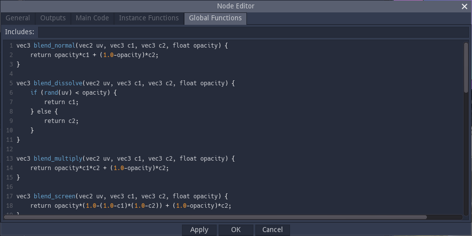

Shader nodes
------------

Most nodes in Material Maker are shader nodes. Their outputs are not defined as images,
but as shader programs that calculate

* the color of a pixel from its coordinates for greyscale, color and RGBA outputs

* the signed distance of a 2D point from its coordinates for SDF2D outputs

* the signed distance of a 3D point from its coordinates for SDF3D outputs

When shader nodes are connected, Material Maker will combine their shader programs.
As a consequence, most shader nodes are resolution independant.

Editing a shader node will show the **Node Editor** window.

Defining a shader node interface
^^^^^^^^^^^^^^^^^^^^^^^^^^^^^^^^

A shader node will always have outputs that will be connected to the inputs of other
nodes. It may also (and probably will) have parameters that can be modified in the
user interface, and inputs to receive data from other nodes.

Inputs and parameters can be added in the **General** tab, but first, you may want to
choose a nice name for your new node.

Parameters
~~~~~~~~~~

To add a parameter, just click on the green "+" button in the Parameters section.
A new parameter line will be created with a red "-" button on its left to delete
the new parameter. On this line:

* the first text field is the name of the parameter, that will be used in the shader code
* the second text field is an optional label that will be displayed in the user interface.
  There are a few tricks with this label that can help tweaking the UI.
* the yellow document button can be used to add a tooltip to the parameter.
* the option button can be used to select a type for the parameter. The available types
  are **float**, **size**, **enum**, **boolean**, **color** and **gradient**
* on the right of the type selector, controls can be used to define a default value and
  constraints for the parameter
* **float** parameters can be assigned a **control** variable in the 2D preview

To use a parameter in your shader code it is necessary to prefix it with a dollar sign.
So a **foo** parameter can be refered to by **$foo** or **$(foo)** in the shader code.
Gradient parameters need to be used as functions with a single float parameter.
So **mygradient** should be refered to as **$mygradient($uv.x)** if you want to spread
the gradient on the x axis (**$uv** is an implicit variable used by Material Maker for
UV coordinates).

Inputs
~~~~~~

Inputs can be added and removed, have a name and a label (but no label trick) just
like parameters. they also have a type that can be **Greyscale**, **Color** or
**RGBA**.
Please note that Material Maker will convert automatically if you connect an input
to an output of a different but compatible type.

The yellow document button can be used to define a name and add a tooltip to the input.

On the right of the input type, you must define a default value that will be used
if the input is not connected. The default value is a GLSL expression that must
evaluate to a **float** for **Greyscale**, a **vec3** for **Color** or a **vec4**
for **RGBA**. Inputs default values can use the **$uv** implicit variable. You may
want to define interesting default inputs for your nodes, so it is possible
to see their effect without connecting the inputs (the screenshot above is the
Blend filter and has a vertical and an horizontal gradient as default inputs).

The "Function" checkbox changes the way the code is generated for this input.
When set to true, the input is generated as a function and can be used in the *Instance
functions* section. If the parameter is false, the input code is inlined. It is not advised
to set this parameter to true when not required, because generating functions can have
an impact on performance.

In shader code, inputs are used as functions that take a single **vec2** parameter. For
example **$myinput(2.0*$uv+vec2(0.2, 0.3))** refers to **myinput**, scaled and translated.

Outputs
~~~~~~~

Outputs are defined in the **Outputs** tab and are very similar to inputs, but instead
of a default value, the generated value of the output should be specified as a
GLSL expression (**float** for **Greyscale**, a **vec3** for **Color** or a
**vec4** for **RGBA**). This expression can use everything in the node (parameters,
inputs, main code, instance functions and global functions) except other outputs.
And generally, complex nodes mean complex output expressions. You may thus want to
write simple expressions in the **Outputs** tab and keep complex code in the 3
remaining tabs.

The yellow document button can be used to define a name and add a tooltip to the input.

Adding the actual GLSL code
^^^^^^^^^^^^^^^^^^^^^^^^^^^

Now that parameters, inputs and outputs are defined, the code that will actually
generate the texture will be in the 3 remaining tabs.

Global functions
~~~~~~~~~~~~~~~~

The Global functions tab is used to define the functions that are necessary to
implement the texture generator. Those functions will be included only once (when
the node is used of course) and cannot use parameters or inputs. This is
typically where you will paste the code you prepared in Shadertoy.

Instance functions
~~~~~~~~~~~~~~~~~~

Instance functions are functions that are unique to an instance of the node.
They will typically depend on parameters, and those could either be used as
parameters when calling global functions, or to form global function names (as
shown in the screenshot below: the blend_type parameter is an enum whose value
is the suffix of one of the blend functions defined in the Global Functions panel).

Instance functions must also have a unique name, and the name implicit variable
can be used to do this: whenever $name or $(name) is used, it will be replaced
with a unique name that depends on the node instance.

Main code
~~~~~~~~~

This tab contains code that will be inserted into the main combined shader and
can be used to define variables that will be used in the outputs expressions.
This can be useful either to simplify the outputs or to define variables that
will be used by several outputs (hence optimizing the shader code).

Main code can use the node's parameters and inputs as well as instance and
global functions.

Since a node can be sampled for several different UV expressions in the same
combined shader, it is necessary for all variables declared in the main code section
to have a unique name for each (node instance, UV expression) pair. Material
Maker provides the name_uv implicit variable for this.

