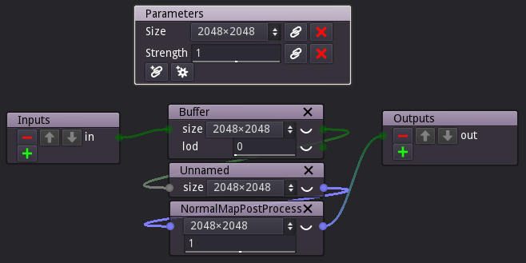

Subgraph nodes
--------------

Subgraphs are parts of a complex material graph that have been gathered into
their own level of hierarchy.

To create a subgraph, first select the nodes that must be grouped and use the
**Tools -> Create group** menu item or the **Control+G** keyboard shortcut.
This will replace all selected nodes with a single subgraph node, without
modifying the overall material description.

When the subgraph is created, it is shown in the graph editor, and can be
renamed using the top right text field (which is recommended if you intend
to use several instances of that subgraph in your project).
The yellow doc button next to this text field can be used to define the
Group Node's tooltip.

The subgraph node is not editable by default, but using the **Control+W**
shortcut will make it possible to edit its contents using the pencil button.

Double clicking a subgraph node will directly enter it.

The newly created subgraph contains:

* all nodes that have been grouped
* an **Input** and an **Output** node that represent the inputs and the outputs
  of the subgraph. Selecting them and using the **Control+W** shortcut makes them
  editable so the subgraph inputs and outputs can be added, removed, reordered,
  renamed or have their types modified.
  Subgraph inputs and outputs can also be assigned tooltips (by clicking on the
  yellow document button) and be associated to a port group (by clicking on the
  blue circle button).
  Please note that all those operations will (when possible) keep connectivity
  inside and outside the subgraph.
* A **Parameters** node that is a **remote** can be edited to expose selected
  parameters to the parent graph. When grouping nodes with a **remote**, the
  remote will automatically be used as **Parameters** node in the nealy created
  subgraph.
  Remote parameters can also be assigned tooltips by clicking on the yellow
  document button.

Propagating changes from a graph node
^^^^^^^^^^^^^^^^^^^^^^^^^^^^^^^^^^^^^

When several instances of a subgraph node is used in a project, it is possible
to make sure all of them are identical (except for their parameter values).
To do this, right click the Subgraph node you wish to replicate, and select
the **Propagate changes** menu entry. You will be prompted to confirm updating
all subgraph nodes with the same name. Just click the **OK** button and the
contents all those node will be updated.

