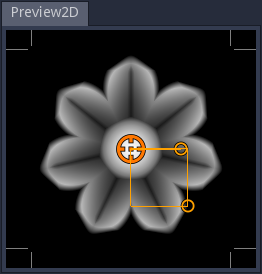

2D Preview panel
^^^^^^^^^^^^^^^^

The 2D preview panels shows a preview of the selected node outputs. Selecting a node
will always show its first output in the first 2D preview. Left clicking an output
port will show it it the first 2D preview panel.

Holding the **Control** key while clicking an output will lock that preview selection,
so it will not be changed by node or output port selection. Control clicking the locked
previewed output will cancel the lock.

Holding the **Shift** key while clicking (or control clicking) an output port will show
the preview in the second 2D preview panel.

The corner lines (and outer lines of the grid) show the bounds of the texture, so it is
easy to check that the texture wraps correctly.

The mouse wheel can be used to zoom, and holding the middle mouse button makes it possible
to pan across the preview.

Depending on the selected node, controls can be shown and they can be moved
around to modify the associated parameters.

The 2D preview panel has a context menu that can be used to:

* reset the preview zoom and position

* select the style and color of axes displayed on top of the preview

* select the view mode (extend, repeat, clamp or temporal antoaliasing)
  of the preview

* export the previewed node to a file

* export the previewed node's animation to a set of files or a spritesheet

* render the previewed node and add it to the References panel

* select a post process filter (available filters are useful to create
  pixel art textures in different resolutions)

Exporting animations
~~~~~~~~~~~~~~~~~~~~

Selecting the **Export animation** item in a 2D preview's context menu will show the
Export Animation window.

This window shows controls to select the export size, the beginning and end times of the
animation, the number of frames and a choice for generating several PNG image files,
or a single spritesheet (that can be generated as a single, 2 or 4 rows of images).

The window also shows the beginning image, the animation (taking beginning and end times
into account), and the end image.

While modifying the beginning or end time, the center image shows a difference of both
images (similar parts are shown in black, and differences in red), so it is easy to
tune those values to generate a nice animation loop.

Clicking the **Export** button will prompt for a file name. When generating a spritesheet,
the name will be used as-is, but if several PNG files are generated, the file name will be
suffixed with an underscore character followed by the frame index (starting with 1). It is
possible to avoid that behavior by setting a name that contains consecutive sharp (#)
characters that will be replaced with the frame index (prefixed with zeroes if necessary).
