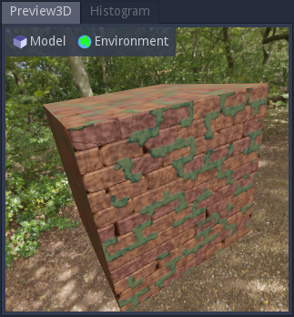

3D Preview panel
^^^^^^^^^^^^^^^^

The 3D preview panel shows a 3D preview of the current material.

The *Model* menu can be used to:

* select a model for the 3D preview

* show a popup to configure its UV scale and specify if it should be tesselated or not

* start and stop the object's rotation animation

* generate the following mesh maps:

  * Mesh Normal Map: Stores object space normals.

  * Inverse UV Map: Stores object space positions.

  * Curvature Map: Stores how curved parts of the object are.

  * Ambient Occlusion Map: Stores how occluded parts of the object are from itself.

  * Thickness Map: Stores how thick parts of the object are.

  These options are only available for custom meshes.

Selecting the *Custom* option in the model list will show a file dialog to select a
3D model in Wavefront .obj format. The model should have UV information to correctly
display materials (normals will be generated if they are missing).

When generating a map from a custom mesh, an image node for the generated map will
be stored in the clipboard, and it is possible to directly paste that node into about
a material graph.

The *Environment* menu provides different environments, as well as tonemap options.

In the 3D view, the view can be rotated about the yaw and the pitch axes (from the
camera's point of view) by holding the left mouse button and moving the mouse horizontally
or vertically. The object can also be rotated about the roll axis by holding Shift and
and the right mouse button and moving the mouse horizontally.

Holding the Shift key will rotate the object while the view remains static.

Rotating the object or the camera will automatically disable the object's rotate animation.

The mouse wheel can be used to move the camera along its longitudinal axis (hense zooming
forward or backward).
