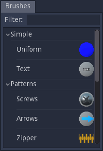

Brush panel
-----------

The Brush panel shows all brushes that are available in the brush base library
and user library in a tree view. The brush user library contains all brushes
that were added using the **Tools -> Add current brush to user library** menu item.

The filter field above the tree can be used to quickly find a specific brush.
The tree will be updated whenever the filter string is modified. It is possible to
give focus to the search field using the **Control+F** keyboard shortcut.

