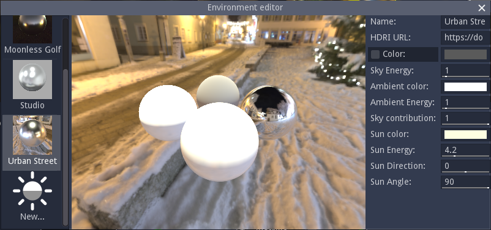

Environment editor
------------------

The **Environment editor** window can be shown using the **Tools -> Environment editor**
menu and is used to create new environments for 3D views (3D preview panel and Paint panel).

It consists of a list of existing environments, a preview of the currently selected environment
and controls that can be used to modify it.

New environments can be created by clicking the **New...** item at the bottom of the environment list.

Environments consist of an HDRI image, ambient light settings and a directional light.
To specify a new HDRI, just enter its URL in the corresponding field (the HDRI file must be
available via http or https, and will automatically be downloaded when needed).
