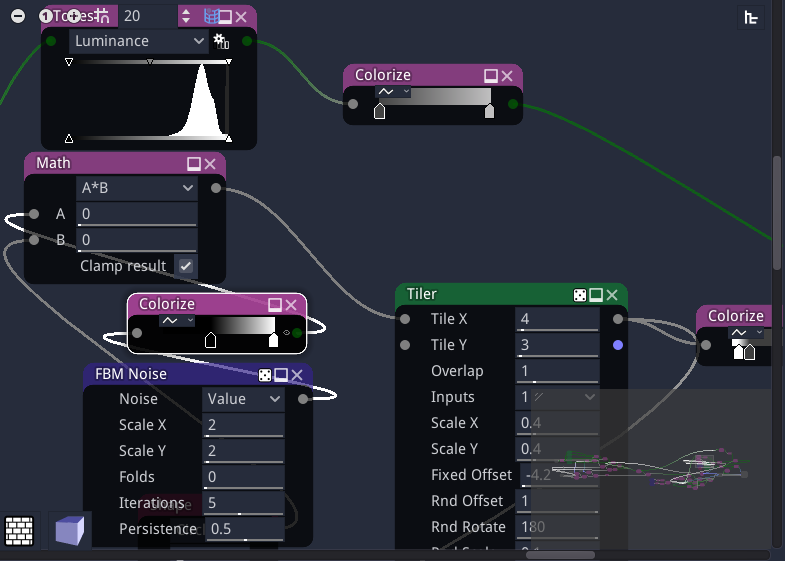
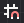
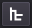
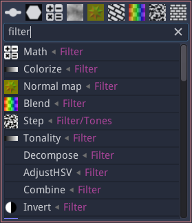

Graph panel
^^^^^^^^^^^

The graph panel is where materials can be edited, by adding and configuring nodes,
and connecting them.

Grid, zoom and minimap
~~~~~~~~~~~~~~~~~~~~~~

.. |zoom_out_button| image:: images/zoom_out_button.png

.. |zoom_in_button| image:: images/zoom_in_button.png

In the top left corner of the graph panel, the following buttons can be used to modify
the zoom level and configure the grid:

 * the |zoom_out_button| button zooms out.
 * the |zoom_reset_button| button resets the zoom factor.
 * the |zoom_in_button| button zooms in.
 * the |grid_button| button toggles the grid. When moved, nodes will
   stick to the grid when it is active. The grid size can be modified
   using the spinbox next to the grid button
 * the |minimap_button| button toggles the minimap that is shown in the bottom right
   corner of the graph view

The view can be centered using the **View -> Center view** menu item or the **C** shortcut,
and the zoom factor can be reset using the **View -> Reset zoom** menu item or the **Alt-0**
shortcut.

The minimap shows an overview of the whole graph. Clicking on it with the left or middle mouse
button will center the graph view on the clicked location. While connecting nodes, it is thus
possible to click on the minimap with the middle mouse button to make the target node visible.

Material navigation
~~~~~~~~~~~~~~~~~~~

.. |group_randomness_button| image:: images/group_randomness_button.png

In the top right corner of the graph panel, the graph navigation button
|graph_navigation_button| can be used to show a tree view of the
material (this is only useful when the Hierarchy panel is not visible).
Double clicking on an item in this tree will show it in the graph view.

When a subgraph is shown in the graph panel, additional items are visible in
the top right corner:

* a text entry shows the name of the subgraph and can be used to modify it.
* a |group_randomness_button| button to decide if the current subgraph transmits
  its random seed to its children.
* a |graph_up_button| button to move to the parent of the currently shown subgraph.

Creating nodes
~~~~~~~~~~~~~~

There are several ways to create new nodes.

They can be dragged and dropped from the **Library** panel to the graph panel.

It is also possible to use the node menu that can be shown using the right mouse
button. This menu has a filter field to quickly find the desired node.

The node menu will also be shown when connecting a node's input or output into
an empty space of the graph. In this case, only compatible nodes will be shown,
and the newly created node will automatically be connected.

Selecting and copying nodes
~~~~~~~~~~~~~~~~~~~~~~~~~~~

Clicking on the title bar of a node will select it. Selecting a node will show its
first output (if any) in the 2D preview. It is possible to select several nodes
by holding the **Control** key while selecting.

Selected nodes can be copied using the **Edit -> Copy** menu or the **Control+C**
keyboard shortcut. They can also be cut using the **Edit -> Cut** menu entry or the
**Control+X** shortcut. Both operations store the selected nodes and their
interconnections in the clipboard. Note that the format used is JSON, and nodes
or group of nodes can easily be shared using this format.

The contents of the clipboard can be pasted into a graph using the **Edit -> Paste**
menu or the **Control+V** keyboard shortcut.

Selected items can also be duplicated using the **Edit -> Duplicate**
menu or the **Control+D** keyboard shortcut. This operation does not affect
the clipboard.

Background 2D preview
~~~~~~~~~~~~~~~~~~~~~

The bottom left "bricks" button can be used to show a 2D preview in the background
of the graph view. 

Background 3D preview
~~~~~~~~~~~~~~~~~~~~~

The bottom left "cube" button can be used to show a 3D preview in the background
of the graph view. The blue/red arrows icon is used to rotate the object or the view,
and other controls are similar to the 3D preview.
