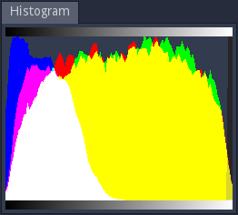

Histogram panel
---------------

The histogram panel shows a histogram of the texture generated by the selected node.

All color channels (red, green, blue and alpha) are represented as seperate histograms
and combined in the same view.

