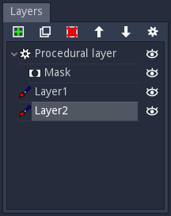

Layers panel
^^^^^^^^^^^^

The Layers panel shows a tree view of all layers that have been created for the current
painting project.

Three types of layers are available:

* **Paint layers**: those layers can have Albedo, Metallic, Roughness, Emission and Depth
  information and can be painted using the tools available in the Paint panel. 

* **Procedural layers**: those layers can have Albedo, Metallic, Roughness, Emission and Depth
  information. They are not painted manually, but have a corresponding brush (edited in the
  Paint panel) that is applied automatically to the whole layer.

* **Mask layers**: a mask layer has a single greyscale channel that is applied as an alpha
  mask to the whole hierarchy of its parent layer. When several masks are applied their
  content is multiplied to generate a single alpha channel.

The painted material is a combination of all layers, applied from bottom to top.

This panel has a tool bar that can be used to create, duplicate, delete, reorder and
configure layers. Configuring a layer consists in defining a transparency level for each
component of paint and procedural layers.

Layers can be dragged and dropped in the tree view, and can also be hidden by clicking their
"eye" button.
