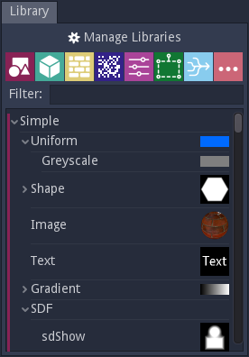

Library panel
-------------

The library panel shows all nodes defined in both and user libraries.
It consists of (from top to bottom):

* a **Manage Libraries** menu
* buttons for all nodes categories
* a node filter
* a tree view where all available nodes are shown

Managing libraries
^^^^^^^^^^^^^^^^^^

The **Manage library** menu can be used to create new libraries and load or unload
existing libraries. Loaded libraries can also be enabled and disabled (their
items will not be shown in the library panel or in the **Nodes menu**).

Each library is saved as a standalone JSON file.

The base library is provided with Material Maker and the nodes it contains are
documented in this manual. It cannot be unloaded or modified.

The user libraries contain all nodes that were added using the
**Tools -> Add selected node to library** submenu. The default **User** library
cannot be unloaded.

Nodes categories
^^^^^^^^^^^^^^^^

Nodes are organised in categories in the libraries. Each predefined category
has a dedicated button at the top of the Library panel. Left clicking a
category will make the category visible in the tree view and the Nodes menu.

The predefined categories are:

* **Simple**: Nodes that define simple shapes (including the SDF subcategory that
  can be used to build more complex shapes)

* **3D**: Nodes that can used to build 3D shapes and 3D textures

* **Pattern**: Various non random 2D patterns

* **Noise**: Nodes that provide random patterns

* **Filter**: Nodes that alter the colors of their input, but not their overall shapes

* **Transform**: Nodes that modify the shapes of their input

* **Workflow**: Nodes that use PBR materials (with albedo, roughness, metallic, emission and
  normal maps) to generate more complex materials

* **Miscellaneous**: Nodes that have a specific use but do not fit in other categories

Filter and tree view
^^^^^^^^^^^^^^^^^^^^

The library tree shows all nodes defined in all loaded and enabled libraries. The left
margin shows the color of the corresponding category.

Nodes can be dragged and dropped from the tree view to a material or brush
graph editor.

The filter field above the library tree can be used to quickly find a specific node.
The tree will be updated whenever the filter string is modified. It is possible to
give focus to the search field using the **Control+F** keyboard shortcut.

.. image:: images/library_filter.gif
  :align: center

Each item in the tree view has a context menu that can be used to rename it, redefine
its thumbnail (using the current 2D preview), or delete it. It is also possible to
define name aliases that will be used by the filter (in the library panel and in the
Nodes menu).
