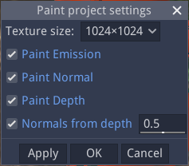

Main menu
---------

The main menu bar is organized in 5 menus:

* the *File* menu contains actions to create, load, save and export materials
* the *Edit* menu has common edit actions cut, copy and paste
* the *View* menu contains actions to customize the graphical user interface
* the *Tools* menu has actions to add items to the user library
* the *Help* menu can be used to find more information and submit feedback about the software

File menu
^^^^^^^^^

* *New material* creates a new material and opens a tab in the center panel to edit it

* *New paint project* prompts for a 3D model to be painted and opens a tab in the center
  panel to paint it.

* *Load* opens a file dialog to select a procedural material (.ptex) or a paint project (.mmpp)
  file. If a material file is selected, it will be open in a new tab in the center panel.
  If the current tab contains an empty material (about material that only consists of a
  Material node), the material will be loaded into this tab. If a paint project was selected,
  it will be opened in a new tab.

* *Save* saves the current material or paint project. If it was not previously saved, a file dialog
  will be displayed to select a location and file name.

* *Save as* prompts for a location and file name and saves the current material or paint project.

* *Save all* saves all currently open materials and paint projects. Projects that were already
  saved are ignored.

* the *Export* submenu can be used to export the current Material or painted textures for Godot, Unity
  or Unreal. It will prompt for a file name and generate PNG files for all components
  of the material. Exporting to one of those engines is described in the
  :ref:`export-section` section.

* *Close* closes the current project.

* *Quit* closes the software.

Edit menu
^^^^^^^^^

* *Undo* reverts the latest change, and *Redo* can be used to re-apply reverted actions.
  In Material projects, all operations on the graph can be reverted. In Paint projects,
  only strokes are taken into account by undo/redo.

* *Cut* Copies the selected nodes to the clipboard and removes them from the current material.

* *Copy* Copies the selected nodes to the clipboard

* *Paste* Copies the clipboard into the current material. Note that the nodes will be added to
  the center of the view, so it is advised to scroll to the correct location before pasting.
  Pasting also unselects all previously selected nodes and selects all newly created nodes,
  so they can easily be moved around.

* *Duplicate* creates a copy of the current selection without affecting the clipboard

* *Duplicate with inputs* is similar to *Duplicate*, but with input links kept

* *Select all* selects all nodes in the current graph view

* *Select none* clears the selection in the current graph view

* *Invert selection* inverts the selection in the current graph view

* *Select sources* selects all direct and indirect source nodes of the current selection

* *Select targets* selects all direct and indirect target nodes of the current selection

* *Load Selection* Loads a graph selection previously saved into a file

* *Save Selection* Saves the current graph selection into a file

* *Set Theme* is used to select the UI Theme

* *Preferences* shows the *Preferences* dialog

View menu
^^^^^^^^^

* *Center view* Centers the current material graph view

* *Reset zoom* Resets the zoom level of the current material graph view

* *Show/Hide side panels* (or the *Control+SpaceBar* keyboard shortcut) can
  be used to hide the side panels so the space available for the main panel
  is maximized (which can be useful on smaller displays).

* the *Panels* submenu can be used to show or hide all side panels

Tools menu
^^^^^^^^^^

* The *Create* submenu can be used to create any of the node templates.

* *Create group* creates a subgraph node with the currently selected nodes,
  and shows the contents of the newly created group in the current graph
  view.

* the *Make selected nodes editable* menu item will toggle edit mode for
  all selected nodes that support it. Shader and graph nodes will show
  3 buttons to edit, load and save the node, switches will show controls to
  modify the number of choices and outputs, and input/output modes will
  become editable.

* *Add selected node to user library* is only visible when the current
  project is a procedural material. It first prompts for an item name. If a name is entered and
  confirmed, the selected nodes in the current material will be added to the user library under
  that name. The user library is saved automatically.

* *Create a screenshot of the current graph*  is only visible when the current
  project is a procedural material. It will prompt for an image file name
  on the disk and save a screenshot of the whole current graph (it will automatically
  pan the graph to create the screenshot).

* *Add current brush to library* is only visible when the current
  project is a paint project. It first prompts for an item name. If a name is entered and
  confirmed, the current brush will be added to the user brush library under
  that name. The user library is saved automatically.

* the *Paint project settings* submenu can be used to show a dialog to configure
  painted textures resolutions and enable or disable different channels of the
  painted material
  

* the *Set painting environment* submenu can be used to select the environment for
  the Paint panel.

* the *Environment editor* menu shows the *Environment editor* window that can be used
  to create new environments for 3D views.

Help menu
^^^^^^^^^

* *User manual* opens an external web browser to show this manual

* *Show selected library item documentation* opens an external web browser to show
  documentation from the User Manual for the current library item

* *Report a bug* opens a web browser on the Issues page of Material Maker's GitHub project. Please
  do not hesitate to use it to suggest improvements for Material Maker.

* *About* Shows the about dialog.

