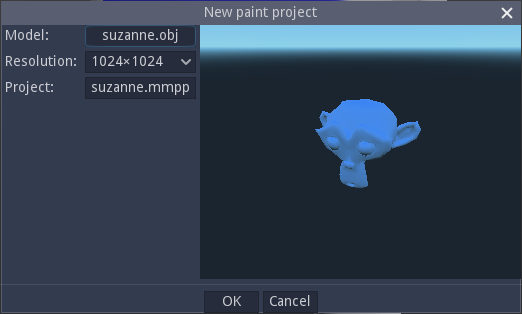
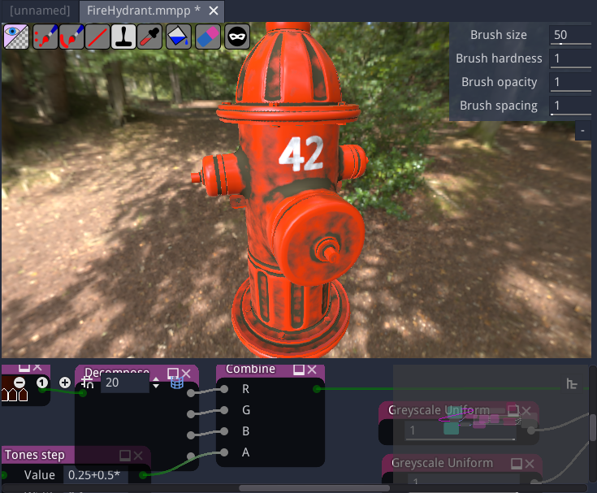
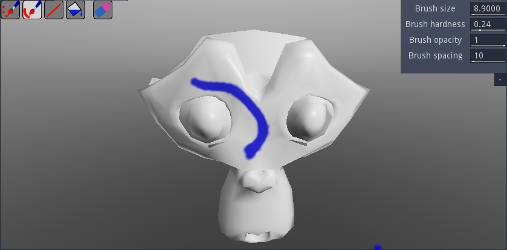
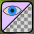
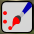
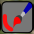
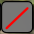
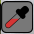
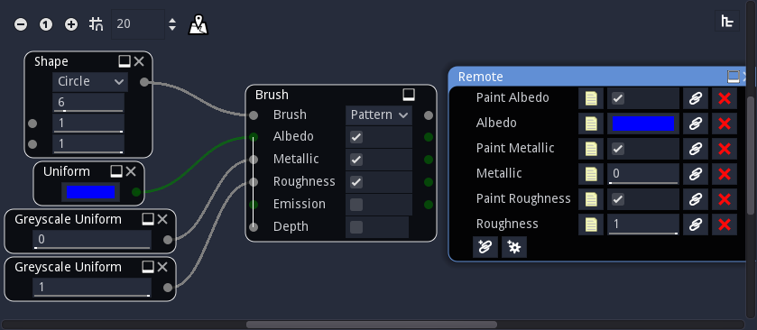
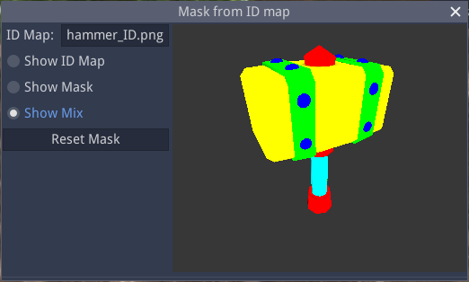

Paint panel
^^^^^^^^^^^

Creating a paint project
~~~~~~~~~~~~~~~~~~~~~~~~

To start painting in Material Maker, just use the *File -> New paint project* menu.
This will show a dialog where a model file and a texture size can be specified.

The model must be provided in either Wavefront ``.obj``, ``.glb``, ``.gltf`` or ``.fbx`` format and
have a single submesh. Of course, the model must have textures coordinates information.

A project file name will be automatically selected, but it is possible to modify
it before creating the paint project.

Clicking on the OK button of the dialog will create the new project and show the
Paint panel, which consists of two sub panels. The top subpanel shows the model
to be painted, and the bottom subpanel shows the graph where the current brush is
described.

Painting a 3D model
~~~~~~~~~~~~~~~~~~~

The paint subpanel is where the model is actually painted. It shows the model with its material
in its current state, and a dynamic preview of the current brush.

Note that for procedural layers, the layer brush is applied to the whole model, and consequently
painting tools are not available. 

In the paint subpanel, the model can be rotated by holding the middle mouse button
and translated by holding the middle mouse button and the Shift key.

The mouse wheel can be used to modify the zoom level. If the Control key is held,
the mouse wheel will adjust the camera's field of view angle.

The left mouse button (with no modifier) can be used to paint on the currently selected layer.
Holding the Shift key and the left mouse button will modify the brush size (by moving
left and right) and hardness (by moving up and down).
Holding the Control key and the left mouse button will modify the pattern size and
orientation (more about brushes and brush types below). Holding the Control key will
also show the patten on the whole view (which can be useful with Pattern and UV pattern
brushes).

In the top left corner of the paint subpanel, buttons can be used to select a painting tool.
The available tools are:

* The painting engine selector |button_paint_engine|, that can be used to switch to one of the
  following painting engines:

  * The View space painting engine, that projects the brush into the current
    view. This engine paints correctly across seams, but since it is aligned
    to the view, the result will be stretched where the painted surface is
    not perpendicular to the view.
  * The texture space painting engine, that paints directly in texture space.
    This engine is view independent and does not distort of stretch the result,
    but cannot paint across seams. Also make sure you see the whole brush before
    painting, to avoid painting on UV islands that are not currently visible.

* A freehand painting tool |button_freehand|, that directly applies the brush to the painted surface

* A freehand line tool |button_freehand_line|, that paints a line following the mouse cursors movement

* A line tool |button_line|, that draws straight lines

* A stamp tool |button_stamp| that allows to place the center of the stamp by pressing the mouse button,
  then adjust its orientation and size before releasing the button

* A color picker tool |button_pick_color|, that can be used to pick colors from the painted model and
  modify the current brush if it is compatible (for example the Uniform brush)

* A fill tool |button_fill| ; pressing this button will directly fill the current layer using
  the current brush, or erase it if the eraser mode is active. Only channels that arte active
  in the brush are affected

* An eraser mode |button_eraser|, that applies to all painting tools

* A mask selector |button_mask_selector| that will show a dialog that can configure the
  painting mask using an ID map

In the top right corner, common brush parameters such as size, hardness, opacity and spacing
can be modified.

Note that before painting, it is necessary to select a brush (by double-clicking it in the
Brushes panel) and a layer.

Creating and modifying brushes
~~~~~~~~~~~~~~~~~~~~~~~~~~~~~~

The bottom subpanel is a graph that can be used to create brushes. This is very similar to
creating materials, except the target node is the Brush node (instead of Material).

The Brush node has 6 inputs:

* the brush input is a grayscale image that defines the shape of the brush. White pixels are painted,
  black pixels are not and grey values are used as alpha. The Brush input is implicitely modified using
  the Brush hardness and the Brush opacity parameters.

* the other channels are color (Albedo and Emission) and grayscale (Metallic, Roughness and Depth)
  images that define the patterns painted on each component of the model's material. Albedo has its
  own alpha channel that is combined with the Brush value and used as transparency for all components.

The Brush node's parameters are the following:

* the Brush type defines how the pattern is applied on the model

  * when **Stamp** is selected, the patterns are mapped on the brush itself. This mode is well suited
    to paint shapes on the model
  
  * when **Pattern** is selected, the pattern repeats on the painting view space. It is useful to paint
    2D patterns directly on the object, but may be difficult to use when painting from different angles.
  
  * when **UV Pattern** is selected, the pattern repeats in texture space. It is generally not used directly
    with 2D patterns, but using the *3D Brush Map* and *Triplanar Brush Map* nodes, it can be use to easily
    fill large portions of the model with a single material. It is also the most flexible mode as it can be
    used to apply 3D textures or effects that depend on the mesh geometry.

* The other parameters (Albedo, Metallic, Roughness, Emission and Depth) are booleans that define if the
  corresponding component of the material will be painted.

Brushes can have a Remote node whose parameters will be shown in the **Parameters** panel.

Custom brushes can be saved into the user brush library using the **Tools->Add current brush to the user
library** menu entry.

Selecting a painting mask
~~~~~~~~~~~~~~~~~~~~~~~~~

The mask selector button |button_mask_selector| will show the mask selection dialog, that can be
used to set the current painting mask. This mask will affect all painting operations.

To modify the painting mask, it is first necessary to load an ID map for the model.

When an ID map has been selected, clicking on the model will assign the corresponding
ID to the mask.

The 3D view of this dialog can be configured to show the ID map, the mask,
or a mix of both.

It is also possible to reset the mask so the whole object can be painted.
