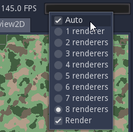

Performance meter and tools
---------------------------

Material Maker relies on shader generation and rendering to generate texture.
It sometimes creates very complex shader that can impact performance, while
trying to provide smooth user experience.

In the top right corner of the user interface, a performance meter shows the
number of frames per second, and a progress bar shows the number of images
that are currently queued for rendering as well as an estimated time before
all generation is performed.

By default, Material Maker will try to render 8 images at the same time.
This behavior can be modified by using the context menu:

* the **Auto** option adapts automatically the number of renderers depending on
  the frames per seconds.
* When the Auto option is disabled, the number of active renderers can be selected
  manually.
* Rendering can also be disabled. Note that while rendering is disabled, all
  previews can be outdated, and consequently incorrect.

  Low Frames per seconds are generally caused by nodes combinations generating
  very complex shaders. When this happens, it is generally a good idea to insert
  a Buffer node to store intermediate results. Note that inserting buffers increases
  the number of intermediate images to be generated (and the time needed to render
  the whole material).