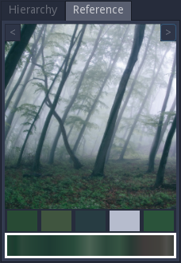

Reference panel
---------------

The reference panel can be used to show images and generated textures, and pick colors and gradients.

To add a reference, simply drag an image file from the filesystem into the reference panel (dragging
an image from the web page can also work depending on the environment).

Only one reference can be shown at a time and the buttons at the top of the panel can be used to
show the previous or the next reference in the list.

The mouse wheel can be used to zoom, and holding the middle mouse button makes it possible
to pan across the image.

This panel has a context menu that can be used to add new reference images and remove the current
reference.

The boxes under the reference image can be used to store 5 colors and a gradient. To store a color,
first select one of the 5 color boxes by clicking on it, and click on the image with the left mouse
button. To store a gradient, click on the gradient box, then click and drag on the image using the
left mouse button.

It is possible to drag and drop colors and gradients from the boxes into the graph panel:

* Dropping a color into the graph panel will create a Uniform node

* Dropping a gradient into the graph panel will create a Colorize node

* Dropping a color into a color parameter or into a cursor of a gradient parameter
  will modify the corresponding color

* Dropping a gradient into a gradient parameter will assign it
