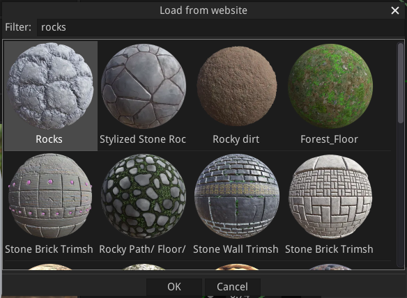
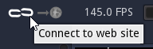
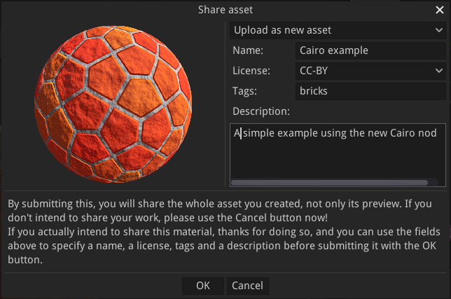
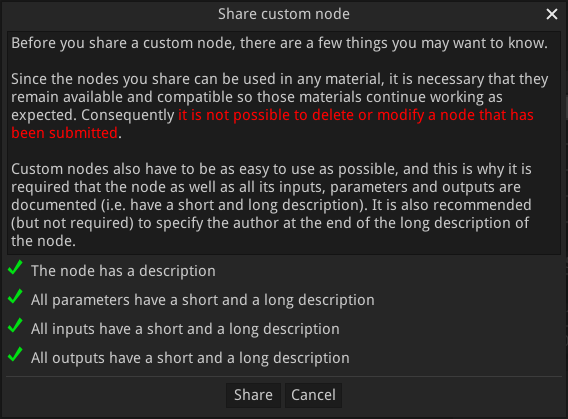

Sharing assets
--------------

Material Maker has a website where users can share their materials and brushes
at the following address: https://www.materialmaker.org

Downloading materials
^^^^^^^^^^^^^^^^^^^^^

To import a material from the website, use the **File -> Load material from
website** menu entry, and select a material from the list.

The **Filter** field can be used to filter materials using their name, description,
or associated tags.

Downloading brushes
^^^^^^^^^^^^^^^^^^^

To import brushes from the website, just use the **Get more brushes** button
in the top right corner of the **Brushes** panel (only available for painting
projects). A **load from website** dialog will be shown with all available
brushes, and selecting one will download it and set it as current brush.
It can then be modified and saved into a library using the **Tools -> Add
current brush to library** menu.

Downloading environments
^^^^^^^^^^^^^^^^^^^^^^^^

Environments can be imported from the **Environment Editor** using the **Download
environment** button at the bottom of the dialog.

Downloading custom nodes
^^^^^^^^^^^^^^^^^^^^^^^^

To import nodes from the website, just use the **Get more nodes** button
in the top right corner of the **Library** panel. A **load from website**
dialog will be shown with all available brushes, and selecting one will
download it and add it into the current graph (in the center of the
graph view).
It can then be modified and saved into a library using the **Tools -> Add
selected node to library** menu.

Uploading assets to the website
^^^^^^^^^^^^^^^^^^^^^^^^^^^^^^^

Before uploading assets to the website, it is necessary to create an account
and log in.
Accounts are created on the website using the **Register** link. Please make
sure you don't use your email address as user name, since this name is
visible from other users. The email address is optional and will only be used
to recover your account.

To log in, use the connect button, enter your account name and password in the
**Login to website** dialog and use the **Log in** button. The **Register**
button can be used to open a web browser on the Register page of the website.

When logged in, it is possible to upload assets to the website:

- The current material can be uploaded using the **Send material to website** next
  to the connect button
- When the active project is a painting project, the current brush will be shared
  using the same button
- Environments can be uploaded using the **Upload environment** button at the bottom
  of the **Environment editor**
- Custom nodes can be shared using the **Share node on website** item of the context
  menu.

When uploading an asset, the **Share asset** dialog will be shown to select a name,
a license, tags, and a description for the asset. For materials, brushes and
environment, it is possible to update an existing asset or create a new one.

When uploading a custom node, the **Share custom node** dialog will be shown before
the **Share asset** window, to verify that all requirements for sharing a node
are met (the node must be documented as well as all its parameters, inputs and
outputs).

